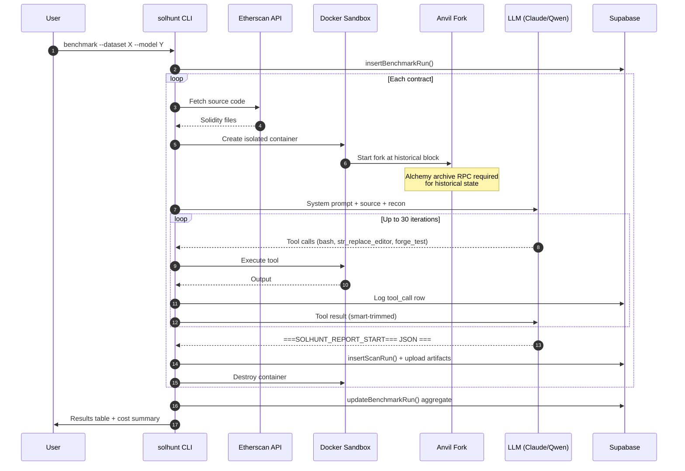
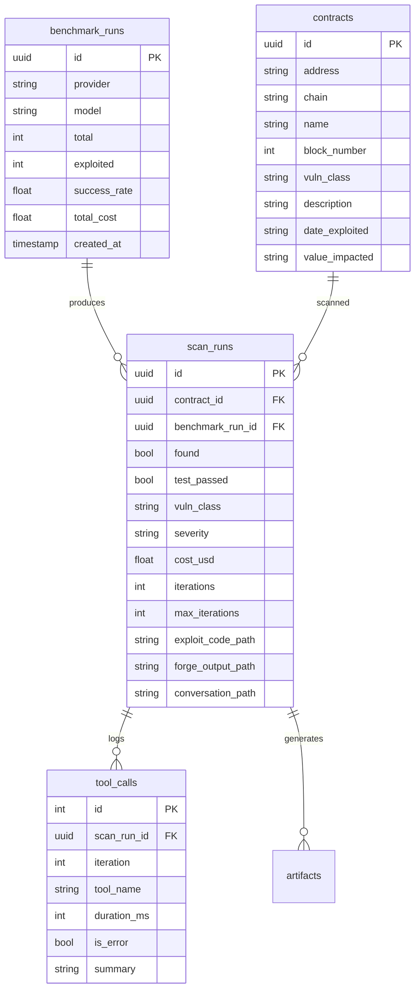
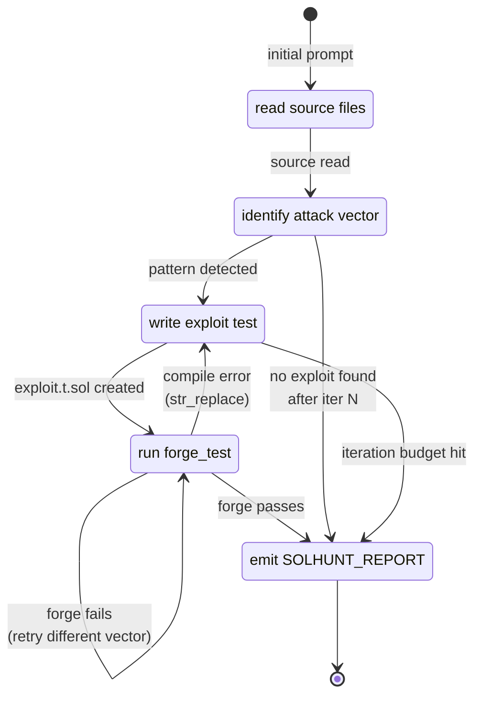
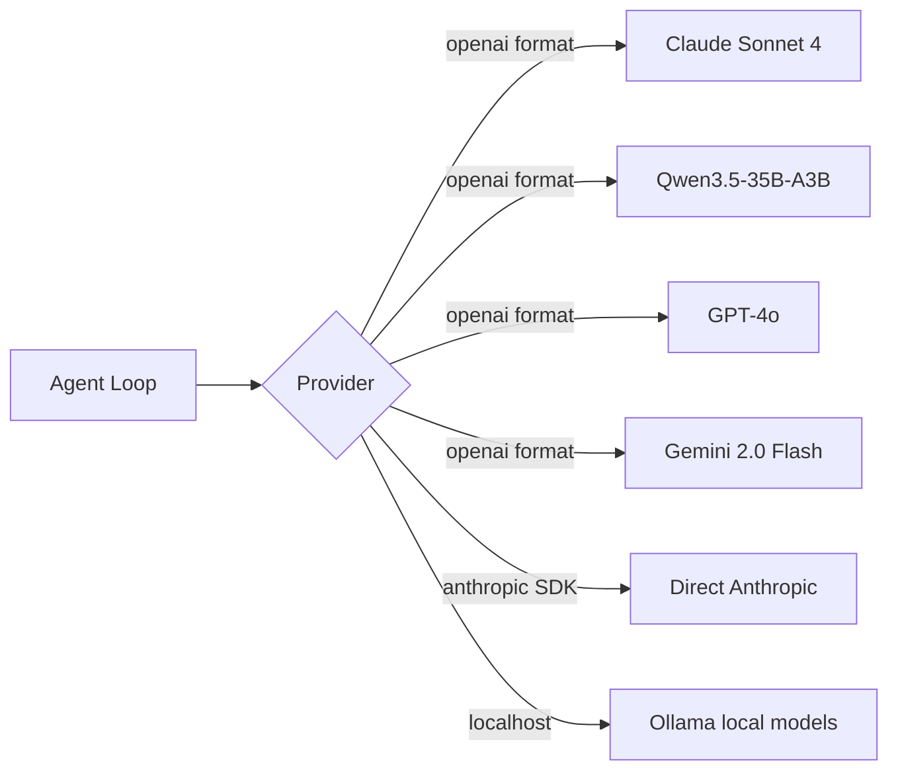

# solhunt Architecture

## End-to-end scan flow

## Data model

## Agent loop state machine

## Key design decisions

### Why Docker sandbox per scan
- Isolation: agent can't escape or affect host
- Reproducibility: every scan starts from identical state
- Preloaded DeFi libs (Aave V3, Compound, Uniswap V2/V3, OZ v4+v5, Chainlink)
- Destroyed after scan, no lingering state

### Why Alchemy (archive node)
- Historical block forking requires archive state
- Free public RPCs (llamarpc, publicnode) don't serve archive state
- Alchemy free tier: 300M compute units/month, sufficient for benchmarks
- We hit this as a hard blocker before switching

### Why Supabase for persistence
- Separates transactional data (pg) from artifacts (storage bucket)
- Service role key = no auth surface for our internal pipeline
- Artifacts stored as `runs/<scan_id>/{exploit.sol, conversation.json.gz, forge_output.txt}`
- Queryable from analysis scripts without re-fetching

### Why fire-and-forget flush pattern
- `DataCollector` buffers tool calls, messages, artifacts in memory during scan
- One `flush(scanRunId)` call after scan completes
- All Supabase writes wrapped in try/catch that never throws
- Scan result is never blocked by storage failures
- If Supabase is down, we still get the scan result, we just lose persistence for that run

### Why auto-checksum addresses
- LLMs emit lowercase hex addresses frequently
- Forge rejects with EIP-55 checksum errors
- Agent wastes 5-10 iterations fighting this
- Fix: regex replace all 0x[40 hex] with keccak256-computed checksums on every .sol file write

### Why vm.prank false-positive guard
- `vm.prank(admin)` makes next call appear from admin
- Agent discovered it could "exploit" access-controlled functions this way
- But pranking as owner to call owner functions proves nothing
- System prompt now lists valid uses (whale, EOA, governance-after-vote) and flags invalid use

## Cost circuit breaker

Two layers of protection:

1. **Failure circuit breaker** (existing):
   - If last 3 contracts all failed without producing a report → stop
   - If last 3 contracts all hit the same error → stop

2. **Budget circuit breaker** (new):
   - `--max-budget <usd>` global cap
   - Checks cumulative cost between batches
   - Stops immediately if cap exceeded
   - Warns at 75% usage

Without these, a stuck agent in a 30-iteration loop at $3+ per contract could burn through a $80 budget in the first ~27 contracts.

## Model abstraction

One provider abstraction, multiple backends. Qwen-specific handling: append `/no_think` to disable reasoning on local models. Cost calculated per-token against PRICING table.
